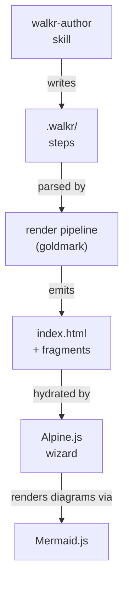

[walkr]{def=walkr} reads a folder of authored steps and turns them into the
page you're looking at right now. The steps are plain markdown with frontmatter; a small
[render pipeline]{def=render-pipeline} turns that into HTML; the browser side
(Alpine + Mermaid) handles navigation, modals, and diagrams, no server required once
it's built.

:::deep{title="Why build the UI before the format?"}
It's tempting to design frontmatter keys and directive syntax on paper first. In
practice that produces fields nothing renders and directives the UI can't actually
express well.

Building the Phase 0 prototype on hardcoded dummy data first meant every eventual
frontmatter key and markdown directive was derived from something a real screen
needed: the overview diagram, the two-level code block, the annotated manifest,
the glossary popover, this very modal. Nothing speculative got added to the spec.
:::
